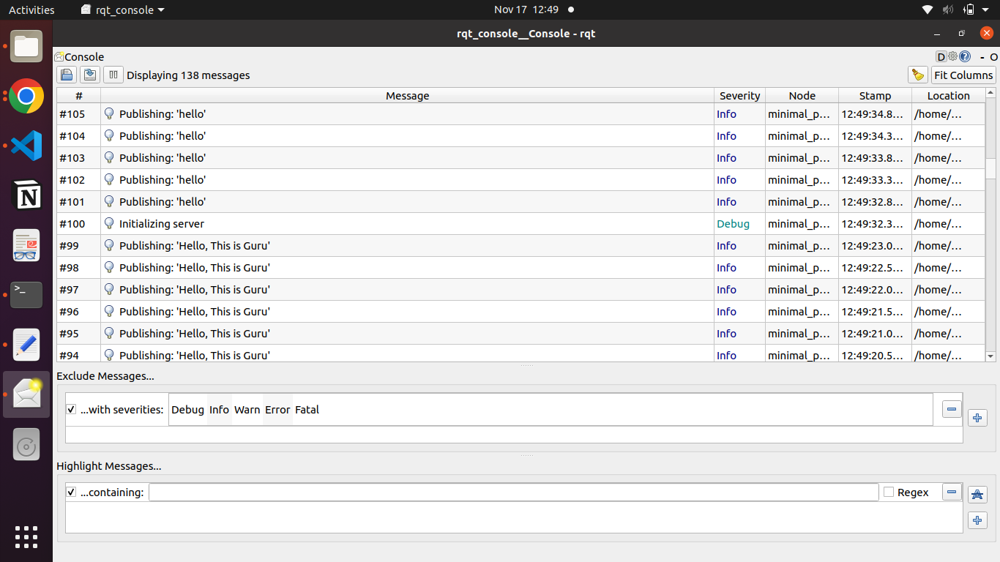

[](https://opensource.org/licenses/MIT)
## Overview

This projects contains a publisher and subscriber node that publishes custom string message to a topic and the subscriber listens to the string published by the publisher node from the same topic.

## Build/run steps

Create a workspace 

```
mkdir -p ~/ros2_ws/src
cd ~/ros2_ws/src
```
Clone the repo into src folder
```
git clone https://github.com/guruadp/beginner_tutorials.git
```
Build the package
```
colcon build --packages-select cpp_pubsub
```
Source the terminal and run publisher with debug mode

```
. install/setup.bash
ros2 run cpp_pubsub talker --ros-args --log-level debug
```

Open a new terminal, source it and run subscriber with debug mode

```
. install/setup.bash
ros2 run cpp_pubsub listener --ros-args --log-level debug
```
* Running service client (change `new_string_to_publish` to the desired string want to publish)
```
ros2 run cpp_pubsub server_client <new_string_to_publish> --ros-args --log-level debug
```
## Run with launch file
```
ros2 launch cpp_pubsub pubsub_launch.yaml freq:=1
```
## rqt_console log output


## Run tf2
```
. install/setup.bash
ros2 run cpp_pubsub talker
```
#### To echo and generate result pdf
```
ros2 topic echo /tf_static
ros2 run tf2_tools view_frames
```
## Google Test
#### Building test
```
colcon test --packages-select cpp_pubsub
```
#### To check the status of the test cases
```
colcon test --event-handlers console_direct+ --packages-select cpp_pubsub
```

## ROS Bag
#### To record run record command and then publisher node
```
ros2 launch cpp_pubsub bag_record_launch.py bag_record:=True
ros2 bag record /chatter
ros2 run cpp_pubsub talker
```

#### To check the recorded file info
```
ros2 bag info <generated_folder>
```

#### To play the recorded file and subscribe it
```
ros2 bag play <generated_folder>
ros2 run cpp_pubsub listener
```

## Dependencies

ROS humble - To install follow the below link

http://docs.ros.org/en/humble/Installation/Alternatives/Ubuntu-Development-Setup.html
